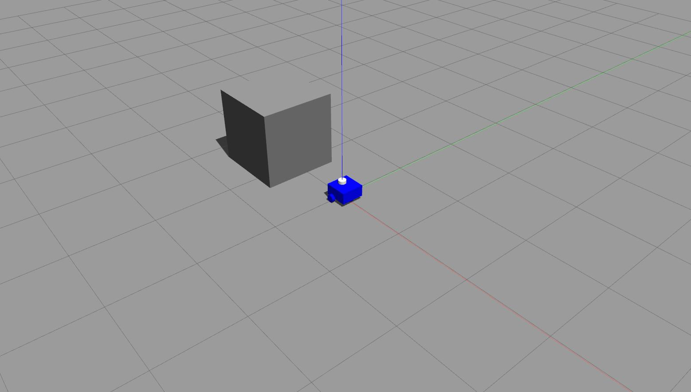
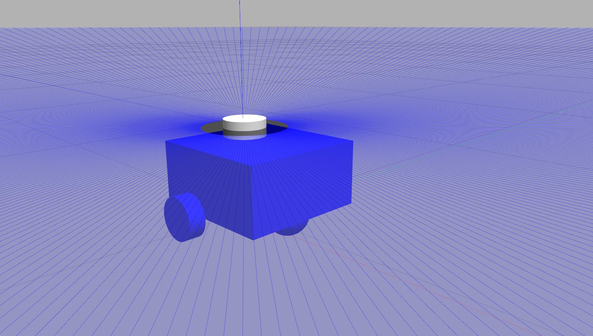
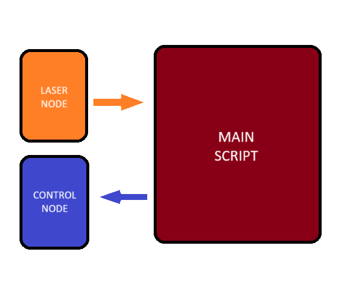

# Differential Drive Robot (DDR) model for use in ROS and Gazebo
<p align="center"></p>

## Recommended configuration

- Configure a [catkin workspace](http://wiki.ros.org/catkin/Tutorials/create_a_workspace).
- [Create packages inside this workspace](http://wiki.ros.org/catkin/Tutorials/CreatingPackage).

For activate the catkin environment you need to run the following prompt command in the project folder
```.cmd
source devel/setup.bash
```
## Launcher files
### [RViz launcher](launch/rviz_launcher.launch)
RViz is a 3D visualization tool for ROS. It is commonly used to visualize sensor data, robot models, and other information in a 3D environment.

In this project, a launch file is provided to facilitate the continuous checking of the design and operation of the physical elements of the robot, as well as the laser sensor.
NOTE: In the launch file, replace the 'textfile' attribute with the path to the robot.urdf file.

```<param name="robot_description" textfile="YOUR_PATH/robot.urdf" />```

For the execution of this launch file, you only need to execute the following code in a command prompt:
```cmd
roslaunch <your package name> rviz_launcher.launch
```
### [Gazebo launcher](launch/gazebo_launcher.launch)
Gazebo is an open-source robot simulation software that provides a 3D environment for simulating robotic systems, including robots, sensors, and environments. It is commonly used in conjunction with ROS to develop, test, and simulate robotic applications before deploying them on physical robots.

The same way before a launch file is provided.
NOTE: In the launch file, replace the 'textfile' attribute with the path to the robot.urdf file.

```<param name="robot_description" textfile="YOUR_PATH/robot.urdf" />```
For the execution of this launch file, you only need to execute the following code in a command prompt:
```cmd
roslaunch <your package name> gazebo_launcher.launch
```

## Design
### First step: [Create the xacro files](robot)
In ROS, Xacro files are commonly used to describe robot models and their components in a more modular and reusable way. Xacro (XML Macros) is a macro language for XML files.
The project has six xacro files:
 - control.xacro: Configures the differential drive for the robot.
 - inertial_macros.xacros: Contains the formulas for computing the inertial properties of the robot's components.
 - material.xacro: Specifies the color of the robot's components for RViz and Gazebo.
 - robot_core.xacro: Configures the physical components of the robot (chassis and wheels).
 - sensors.xacro: Configures the 2D lidar or laser sensor, as well as the contact sensor in the chassis and the lateral wheels.
 - robot.xacro: Integrates all the previously mentioned xacro files into one.

Each xacro was checked with RViz and subsequently with Gazebo. For this check, the robot.xacro file was converted to robot.urdf using the following command:
```cmd
xacro robot.xacro > robot.urdf
```
If you want to convert this URDF file to an SDF file, you can use the following command:
```cmd
gz sdf -p robot.urdf > robot.sdf
```
### Second step: [Materials](robot/materials.xacro)
This file contains the color of each component for RViz and Gazebo visualization. For code reuse purposes, this xacro file was coded using macros. 
### Third step: [Physical elements of the robot](robot/robot_core.xacro)
The structure of each component are describe below:
#### Chassis
```xml
<!--BASE LINK-->
<link name="base_link"></link>

<!--CHASSIS LINK-->
<joint name="chassis_joint" type="fixed">
  <!-- The parent and child element ( BASE LINK -> CHASSIS ), and origin (x, y, z) of the joint  -->
</joint>    

<link name="chassis">
  <visual>
    <!-- Describe the visualization of the chassis: origin, geometry, and color -->   
    <geometry>...</geometry>
    <material>...</material>    
  </visual>
  <collision>
    <!-- Set the area of collision for the chassis element -->
    <!-- Typically, the same physical configuration establish in visual tag-->    
  </collision>
  <!-- Inertial configuration for the chassis-->
  <xacro:inertial_box mass="0.5" x="0.3" y="0.3" z="0.15">
    <origin xyz="0.15 0 0.075" rpy="0 0 0" />
  </xacro:inertial_box>        
</link>
<!-- Chassis color in Gazebo -->
<xacro:blue_gazebo_material object="chassis" />
```
#### Wheels
```xml
<!-- LEFT WHEEL JOINT-->
<joint name="left_wheel_joint" type="continuous">
  <!-- The parent and child element ( BASE LINK -> LEFT WHEEL ), origin (x, y, z) of the joint, and rotation (x,y,z) of the joint  -->
  <!-- NOTICE the continuous type of the joint>
</joint>

<link name="left_wheel">
  <visual>...</visual>
  <collision>...</collision>
  <!-- Inertial configuration for the wheels-->
  <xacro:inertial_cylinder mass="0.1" length="0.04" radius="0.05">
    <origin xyz="0 0 0" rpy="0 0 0"/>
  </xacro:inertial_cylinder>
</link>
<!-- Gazebo material or color-->
<xacro:blue_gazebo_material object="left_wheel" />

<!-- RIGHT WHEEL JOINT-->
<joint name="right_wheel_joint" type="continuous">
  <!-- The parent and child element ( BASE LINK -> RIGHT WHEEL ), origin (x, y, z) of the joint, and rotation (x,y,z) of the joint  -->
  <!-- NOTICE that the rotation of the right wheel is opposite to that of the left wheel -->
</joint>

<link name="right_wheel">
  <visual>...</visual>
  <collision>...</collision>
  <xacro:inertial_cylinder mass="0.1" length="0.04" radius="0.05">
    <origin xyz="0 0 0" rpy="0 0 0"/>
  </xacro:inertial_cylinder>
</link>
<!-- Gazebo material or color-->
<xacro:blue_gazebo_material object="right_wheel" />

<!-- CASTER WHEEL LINK -->

<joint name="caster_wheel_joint" type="fixed">
  <!-- The parent and child element ( BASE LINK -> RIGHT WHEEL ), and origin (x, y, z) of the joint -->
</joint>

<link name="caster_wheel">
  <visual>...</visual>
  <collision>...</collision>
  <xacro:inertial_sphere mass="0.1" radius="0.05">
    <origin xyz="0 0 0" rpy="0 0 0"/>
  </xacro:inertial_sphere>
</link>
<!-- Gazebo material or color-->
<xacro:black_gazebo_material object="caster_wheel" />
<!-- Reducing the friction of the caster wheel with the enviroment -->
<gazebo reference="caster_wheel">
  <mu1 value="0.001" />
  <mu2 value="0.001" />
</gazebo>
```
### Fourth step: [Control](robot/control.xacro)
This XACRO file contains the differential drive plugin to activate the differential drive control for the robot. You can refer to the documentation of sensor plugins in ROS at the following link: https://classic.gazebosim.org/tutorials?tut=ros_gzplugins
### Fifth step: [Sensors](robot/control.xacro)
#### Lidar
The creation of the lidar sensor (or laser sensor) is divide in two steps:

1) Create the physical element that represent the sensor. Various laser sensors are available in ROS, and for this instance, the Hokuyo laser plugin was used.
```.xml
<!-- Laser sensor -->
 
    <joint name="laser_joint" type="fixed">
        <!-- The parent and child element ( CHASSIS -> LASER ), and origin (x, y, z) of the joint -->       
    </joint>
    <!-- Visual, collision, and inertial properties configuration for the lidar sensor -->   
    <link name="hokuyo_link">
        <visual>
            <geometry>...</geometry>
            <xacro:white_material />            
        </visual>
        <collision>
            <geometry>...</geometry>
        </collision>
        <xacro:inertial_cylinder mass="0.1" length="0.04" radius="0.05">
            <origin xyz="0 0 0" rpy="0 0 0"/>
        </xacro:inertial_cylinder>
    </link>
    <!-- Gazebo color configuration --> 
    <xacro:white_gazebo_material object="laser_frame" />
   ```
2) Add the Hokuyo GPU laser plugin and define a topic name for subscribing to the laser data.
<p align="center"></p>

***Note***

You can desactivate the visual representation of the laser setting
```.xml
<visualize>false</visualize>
```

#### Contact sensor
For contact sensor for detect collision in the robot, the bumper plugin was used. See sensors.xacro file for more details.
***NOTE***
Each robot component has a name for the collision tag, specified for the bumper plugin. When referring to each component's collision name, you need to append '_collision' to the collision tag of the plugin.
```.xml
<contact>
   <collision>left_wheel_link_bump_sensor_collision_collision</collision>
</contact>
```
In the case of the chassis, it should be specified in this form:
```.xml
<contact>
   <collision>base_link_fixed_joint_lump__chassis_link_bump_sensor_collision_collision</collision>
</contact>
```
Where the name of the collision chassis tag is chassis_link_bump_sensor_collision.

You can subscribe of the data of each bumper sensor through the following topics:
- ```/robot/right_wheel_contact```
- ```/robot/left_wheel_contact```
- ```/robot/chassis_contact```

## Summary of Command Prompts
### XACRO file to URDF file 
```cmd 
xacro robot.xacro > robot.urdf
```
### URDF file to SDF file 
```cmd
gz sdf -p robot.urdf > robot.sdf
```
### Package for the control of the robot
```cmd
sudo apt-get install ros-noetic-teleop-twist-keyboard
```
### Command for launch the gazebo with an empty world
```cmd
roslaunch gazebo_ros empty.world
```
### Command for launch the model into a gazebo world 
```
roslaunch <your_package_name> gazebo_launcher.launch
```
### Command for launch the RViz with the model
You can use this launch file for visualize the laser capture in RViz.
```
roslaunch <your_package_name> rviz_launcher.launch
```

# Making the Model Functional

To make the model functional, three nodes were designed.

1. The first node, `control.py`, listens to the topic `/controls` published by the main node to retrieve the controls for moving the robot. It then publishes the controls using the topic `/cmd_vel`.

2. The second node, `get_laser_data.py`, continuously acquires 360-degree data from the Hokuyo laser sensor and publishes this data on the topic `/laser_data`.

3. The third node, the main node (`main_script.py`), subscribes to the `/laser_data` topic to get the laser data and publishes controls to the `control.py` node through the `/controls` topic.

***These nodes serve as a simple example of how the power of ROS can be utilized to make a robot functional.***
<p align="center"></p>


